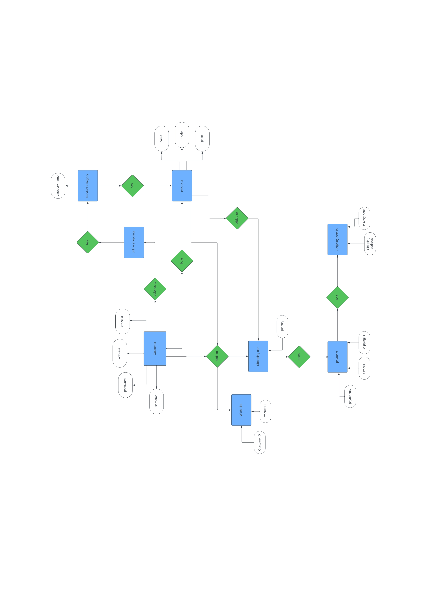
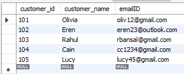
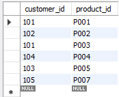
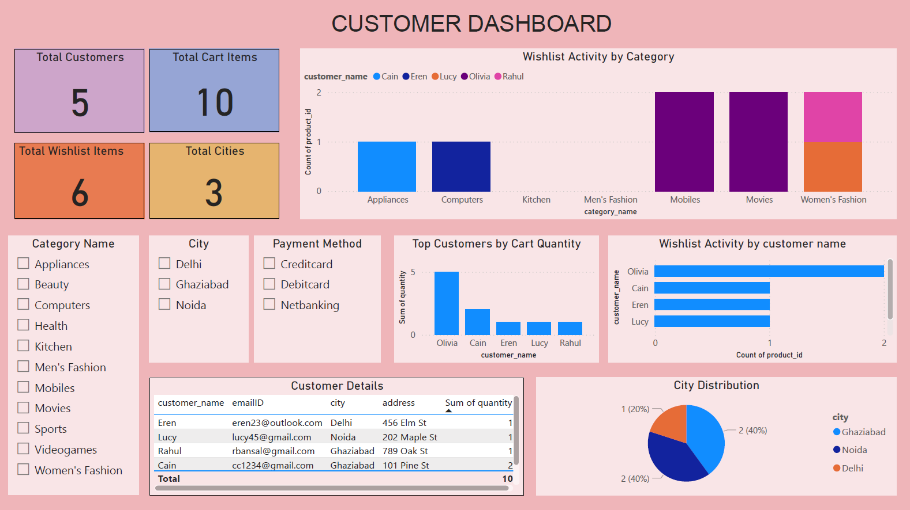
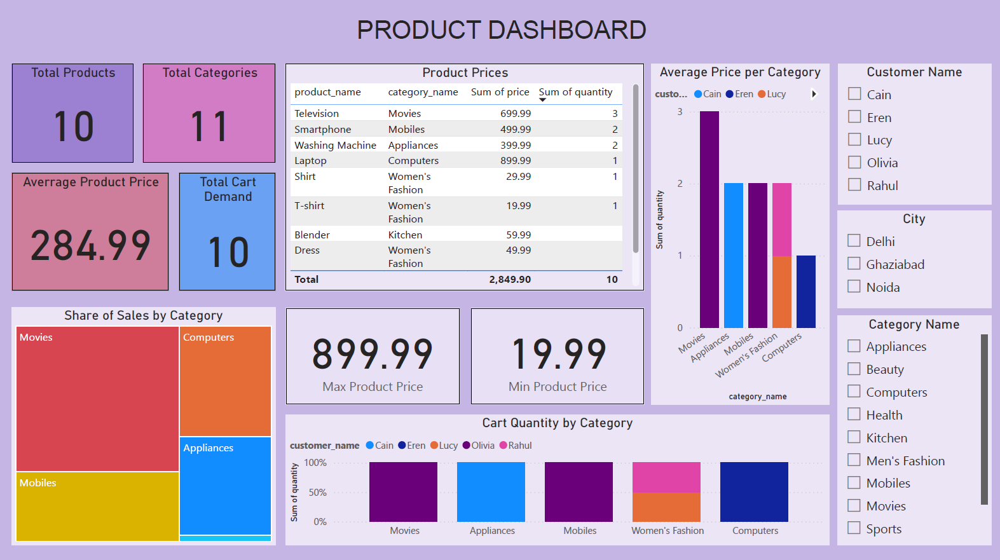
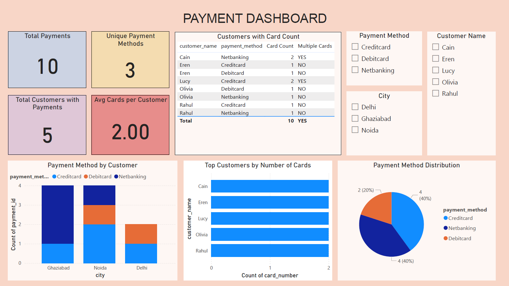

#  Online Retail Database Management System

**Normalized MySQL database** designed for an online retail store — developed as a college project to demonstrate database design, relational integrity, and SQL query proficiency.

---

##  Overview
This project models the essential operations of an online retail system, including:
- Customer records  
- Product categories & inventory  
- Wishlist & shopping cart management  
- Payment & shipping details  

The database is normalized up to **Third Normal Form (3NF)** and ensures **referential integrity** via primary & foreign keys.  

Developed as part of **[Database Management Systems]** at **[SRM IST DELHI NCR]** in **[2024]**.

Additionally, this project integrates the SQL database with **Power BI** to build interactive dashboards, enabling visualization of customer behavior, product demand, and payment trends. These dashboards transform raw SQL tables into actionable business insights.


---

##  ER Diagram


---

##  Example Outputs

### 1️ Customer Table Output


### 2️ Products with Categories


### 3️ Wishlist Join Result


### 4 Customer Dashboard POWER BI


### 5 Product Dashboard POWER BI


### 6 Payment Dashboard POWER BI


---

##  Project Details

- Designed and implemented a **normalized MySQL database** (3NF) for an online retail shopping system, covering customers, products, wishlists, carts, payments, and shipping details.  
- Created an **ER diagram** and converted it into a fully functional relational schema with primary keys, foreign keys, and composite keys.  
- Inserted **sample placeholder data** to simulate real-world scenarios for testing and demonstration.  
- Developed **SQL queries** including INNER, LEFT, and RIGHT JOINs for business analysis (wishlist trends, product listings, payment tracking).  
- Documented the design and workflow in a **detailed project report** and provided **screenshots of outputs** for clear understanding.  
- Proposed **future enhancements** such as order tracking, stock update triggers, stored procedures, and query optimization with indexing.  
- Built **interactive Power BI dashboards** connected to the MySQL database for advanced data visualization:
  - **Customer Dashboard** → Displays customer details, city distribution, wishlist size, and cart activity.
  - **Product Dashboard** → Highlights category-wise sales (calculated as cart quantity × price), average product prices, wishlist demand, and cart demand.
  - **Payment Dashboard** → Analyzes distribution of payment methods, city-level preferences, and identifies customers using multiple cards.
- Designed **DAX measures** to compute key metrics:
  - `Total Sales = SUMX(shoppingcart, shoppingcart[quantity] * RELATED(products[price]))`
  - `Wishlist Count` & `Cart Quantity` per customer.
  - `Average Cards per Customer` and `Multiple Cards` flag.
- Ensured dashboards are **interactive** with slicers for city, product category, and payment method.
- Exported dashboards as **PNG images** for GitHub visualization, in addition to providing the `.pbix` file for direct exploration.


---

##  How to Run

**Using MySQL Workbench**
1. Open `schema.sql` → Execute (creates database & tables)
2. Open `data.sql` → Execute (inserts sample data)
3. Open `queries.sql` → Execute (runs example queries)

**Using MySQL CLI**
```bash
# Create DB & tables
mysql -u <username> -p < schema.sql

# Insert data
mysql -u <username> -p onlineretail < data.sql

# Run queries
mysql -u <username> -p onlineretail < queries.sql

```
Replace <username> with your MySQL username (e.g., root).

---

##  Project Structure

```txt
Online-Retail-Database/
├── schema.sql # Database creation (DDL)
├── data.sql # Sample data insertion (DML)
├── queries.sql # Example SELECTs & JOINs
├── ER_Diagram.pdf # Original ER diagram
├── online_retail_dashboard.pbix # visual dashboard of the database
├── Report.pdf # Detailed documentation
├── screenshots/ # Visuals
│ ├── er_diagram.jpg
| ├── customer_dashboard.png
| ├── product_dashboard.png
| ├── payment_dashboard.png 
│ ├── customers.png
│ ├── products.png
│ └── wishlist.png
└── README.md
```

---


