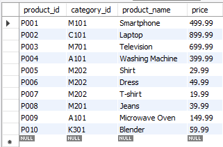

#  Online Retail Database Management System

**Normalized MySQL database** designed for an online retail store — developed as a college project to demonstrate database design, relational integrity, and SQL query proficiency.

---

##  Overview
This project models the essential operations of an online retail system, including:
- Customer records  
- Product categories & inventory  
- Wishlist & shopping cart management  
- Payment & shipping details  

The database is normalized up to **Third Normal Form (3NF)** and ensures **referential integrity** via primary & foreign keys.  

Developed as part of **[Database Management Systems]** at **[SRM IST DELHI NCR]** in **[2024]**.

---

##  ER Diagram


---

##  Example Outputs

### 1️ Customer Table Output


### 2️ Products with Categories


### 3️ Wishlist Join Result


---

##  Project Details

- **Database Purpose**  
  - Designed for an **online retail shopping system** to manage and track customer information, product details, inventory, wishlists, shopping carts, payments, and shipping details.  
  - Acts as the backend foundation for any potential e-commerce web or desktop application.  

- **Entities & Relationships**  
  - **Customer**: Stores personal details (ID, name, email).  
  - **Product Category**: Categorizes products for better inventory management.  
  - **Products**: Contains product details linked to their category.  
  - **Wishlist**: Tracks products that customers are interested in but haven’t purchased yet (many-to-many relationship).  
  - **Shopping Cart**: Manages items customers are planning to purchase, including quantity.  
  - **Payment**: Stores payment details (method, placeholder card number) linked to customers.  
  - **Shipping Details**: Maintains delivery address and city for orders.  

- **Database Design & Normalization**  
  - Structured to **Third Normal Form (3NF)** to avoid redundancy and ensure data integrity.  
  - Used **primary keys** for unique identification and **foreign keys** to maintain relationships between tables.  
  - Implemented **composite primary keys** in many-to-many tables (`wishlist`, `shoppingcart`).  

- **Queries Implemented**  
  - Display all records from each table.  
  - **INNER JOIN**: Customer with Wishlist products.  
  - **LEFT JOIN**: Customers with shopping cart items (shows customers even if they have no cart).  
  - **RIGHT JOIN**: Payments linked to customers.  
  - Category-wise product listing with prices.  

- **Sample Data**  
  - Contains **placeholder records** for customers, products, payments, and addresses.  
  - Payment card numbers are **fictitious placeholders** for demonstration only.  

- **Technical Skills Demonstrated**  
  - Relational database design.  
  - SQL DDL (CREATE, ALTER, DROP).  
  - SQL DML (INSERT, UPDATE, DELETE).  
  - SQL joins, constraints, and indexing.  
  - Database documentation (ER diagram & project report).  

- **Potential Real-World Extensions**  
  - Add an `orders` table for completed transactions.  
  - Include triggers for automatic stock updates.  
  - Add stored procedures for order placement and payment handling.  
  - Create indexes for faster query performance on large datasets.  

---

##  How to Run

**Using MySQL Workbench**
1. Open `schema.sql` → Execute (creates database & tables)
2. Open `data.sql` → Execute (inserts sample data)
3. Open `queries.sql` → Execute (runs example queries)

**Using MySQL CLI**
```bash
# Create DB & tables
mysql -u <username> -p < schema.sql

# Insert data
mysql -u <username> -p onlineretail < data.sql

# Run queries
mysql -u <username> -p onlineretail < queries.sql

```
Replace <username> with your MySQL username (e.g., root).

---

##  Project Structure

```txt
Online-Retail-Database/
├── schema.sql # Database creation (DDL)
├── data.sql # Sample data insertion (DML)
├── queries.sql # Example SELECTs & JOINs
├── ER_Diagram.pdf # Original ER diagram
├── Report.pdf # Detailed documentation
├── screenshots/ # Visuals
│ ├── er_diagram.png
│ ├── customers.png
│ ├── products.png
│ └── wishlist.png
└── README.md
```

---


